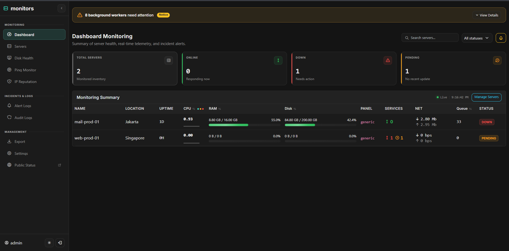
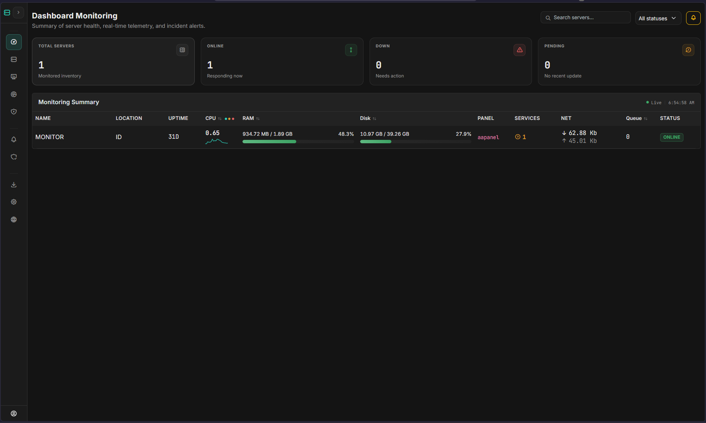

<div align="center">

# 📡 Monitors

**Lightweight, High-Performance Self-Hosted Infrastructure & Server Monitoring Platform**

Real-time telemetry, S.M.A.R.T. disk health, ICMP/HTTP ping monitors, IP reputation checks, and multi-channel alerting with zero third-party dependencies.

[](https://php.net)
[](https://mysql.com)
[-success?style=flat-square)](https://github.com/nocturnalismee/monitors)
[](https://github.com/nocturnalismee/monitors)
[](LICENSE)

</div>

## 📸 Preview

<p align="center">
  
  <br />
  
  <br />
  <em>Dashboard Monitoring </em>
</p>

---

## 📌 Overview

**Monitors** is an enterprise-ready, self-hosted monitoring suite built with native PHP 8.2+ and MySQL 8.0. Designed for DevOps engineers, System Administrators, and hosting providers who demand **instant visibility, zero runtime bloat, and rock-solid reliability** without the memory overhead of bulky monitoring stacks.

Monitors adheres to a clean Front Controller architecture, custom PSR-style autoloader, secure session management, and fully normalized MySQL schemas with real-time partitioning and automatic rollup history.

---

## ✨ Core Features

### ⚡ 1. Real-Time Telemetry & Live Dashboard
* **Sub-Second Streaming**: Live metric streaming via **Server-Sent Events (SSE)** with graceful, non-blocking AJAX polling fallback.
* **Interactive KPI Fleet Cards**: Instant one-click filtering by operational status (*Online*, *Down*, *Pending*).
* **Live Search & Fast Triage**: Real-time client-side filter by hostname, IP address, geographical location, or panel profile without page reloads.
* **Synchronized Metrics Inspection**: Historical ECharts (`CPU`, `RAM`, `Disk`, `Network`) connected via synchronized crosshair scrubbers for accelerated root-cause analysis.
* **Visual Threshold Guides**: Configurable warning and critical marklines displayed right inside telemetry plots.

### 💾 2. S.M.A.R.T. Disk Health Telemetry
* Dedicated disk condition tracking via `agent-disk-health.sh`.
* Monitors drive health percentage, Power-On Hours (POH), Total Bytes Written (TBW), reallocated sector counts, and drive temperature trends.

### 🌐 3. ICMP Ping & HTTP/HTTPS Availability
* Continuous round-trip latency tracking (min, avg, max, packet loss).
* HTTP/HTTPS endpoint monitoring with expected response status code validation and SSL certificate validation.
* Interactive web-based terminal simulator for immediate on-demand diagnostic pings.

### 🛡️ 4. IP Reputation & Blacklist Protection (RBL/DNSBL)
* Automated blacklist scanning across industry reputation providers (Spamhaus ZEN, Barracuda, SpamCop, SORBS, etc.).
* **Smart Resolver Block Mitigation**: Built-in detection for Spamhaus `127.255.255.x` open-resolver query refusals, preventing false-positive incidents when using public resolvers (e.g. `8.8.8.8` or `1.1.1.1`).

### 🔔 5. Multi-Channel Incident Alerting & Lifecycle
* **Channels**: Instant notifications via **Telegram Bot** and **SMTP Email**.
* **Incident Lifecycle**: Comprehensive state management (*Active*, *Acknowledged*, *Snoozed*, *Resolved*).
* **Anti-Flapping & Cooldown**: Smart cooldown engine prevents notification storms during transient network spikes, while ensuring genuine post-recovery incidents trigger immediately.

### 🔒 6. Security & Ingestion Integrity
* **Hashed Agent Tokens**: Ingested tokens are stored as non-reversible `SHA-256` hashes (`CHAR(64)`).
* **Optional HMAC-SHA256 Ingest Signing**: Protect against replay and spoofing attacks via `X-Server-Timestamp` and `X-Server-Signature` headers.
* **Bot Protection & Rate Limiting**: Native Cloudflare Turnstile integration for login access and file-based token bucket rate limiters.
* **Role-Based Access Control (RBAC)**: Distinct permissions for `admin` (management & configuration) and `viewer` (read-only monitoring).

---

## 🏗️ Architecture & Directory Layout

```
monitors/
├── app/
│   ├── Console/Workers/     # Background cron worker implementations
│   ├── Controllers/         # Clean HTTP controllers (Admin, Api, Auth, Public)
│   ├── Http/                # Kernel, Request, Response, Router, & Middleware
│   ├── Repositories/        # Database access abstractions
│   ├── Services/            # Core business domain logic (Alert, Ping, Metrics, IP Rep)
│   ├── Support/             # Globals, Autoloader, Security, Cache, RateLimiter, View
│   └── Views/               # Modular PHP views and modern UI layouts
├── agents/                  # Push monitoring bash agents & systemd daemon units
├── config/                  # Bootstrap chain & local environment loader
├── database/                # Canonical schema.sql, seed data, and versioned migrations
├── docker/                  # Container support (entrypoint, php.ini, apache conf)
├── docs/                    # Usage docs (docker.md, screenshots)
├── public/                  # Document Root (index.php, install.php, router.php, assets/)
├── routes/                  # Clean URL route declarations (web.php, api_*.php)
├── Dockerfile               # PHP 8.2 + Apache + cron workers image
├── docker-compose.yml       # Full stack: app + MySQL 8.0 + Redis
├── storage/                 # Runtime logs, cache, exports, backups, and rate-limit locks
├── tests/                   # Architecture, helper, and schema consistency test suites
└── workers/                 # CLI entry points for cron execution
```

---

## 🚀 Quick Start & Installation

### Prerequisites
* **PHP 8.2+** with extensions: `pdo`, `pdo_mysql`, `openssl`, `mbstring`, `curl`
* **MySQL 8.0+** or **MariaDB 10.5+**
* Web Server: **Nginx** (recommended) or **Apache** with `mod_rewrite`
* *Alternatively*: **Docker + Docker Compose** (Method B below — no PHP/MySQL needed on the host)

---

### Method A: Web Installer (Fastest)

1. Clone or upload the repository to your server:
   ```bash
   git clone https://github.com/nocturnalismee/monitors.git
   cd monitors
   ```
2. Point your web server's Document Root to the `public/` directory.
3. Ensure the `storage/` and `config/` directories are writable by your web user (`www-data` / `nginx`):
   ```bash
   chmod -R 775 storage config
   ```
4. Open your browser and navigate to:
   ```
   http://your-server-ip-or-domain/install.php
   ```
5. Follow the step-by-step setup wizard to configure your database and create the initial administrator account.
6. **Security Note**: Once installation succeeds, create `config/.installer-locked` (or delete/rename `public/install.php`) to disable the installer. A reminder banner is shown to admins while the installer stays reachable.

---

### Method B: Docker Compose (Full Stack)

No PHP/MySQL setup needed on the host — includes the app, MySQL 8.0, Redis, and all background workers via container cron:

```bash
git clone https://github.com/nocturnalismee/monitors.git
cd monitors

export DB_PASSWORD="strong-password-here"
export DB_ROOT_PASSWORD="strong-root-password"
export APP_KEY="$(php -r 'echo bin2hex(random_bytes(32)), PHP_EOL;')"

docker compose up -d --build
```

Then open `http://localhost:8010/install.php` (Database host: `db`, port: `3306`, name: `servmon`, user: `servmon`, password: your `DB_PASSWORD`) and follow the wizard. See [`docs/docker.md`](docs/docker.md) for details, updates, and useful commands.

---

### Method C: Manual CLI Setup

1. Copy the example configuration:
   ```bash
   cp config/local.example.php config/local.php
   ```
2. Edit `config/local.php` with your database credentials and an application key:
   ```php
   return [
       'APP_NAME' => 'monitors',
       'APP_ENV'  => 'production',
       'APP_URL'  => 'https://monitor.yourdomain.com',
       'APP_KEY'  => bin2hex(random_bytes(32)),
       'DB_HOST'  => '127.0.0.1',
       'DB_PORT'  => '3306',
       'DB_NAME'  => 'monitors',
       'DB_USER'  => 'your_db_user',
       'DB_PASS'  => 'your_db_password',
   ];
   ```
3. Run schema setup and migrations:
   ```bash
   mysql -u your_db_user -p monitors < database/schema.sql
   mysql -u your_db_user -p monitors < database/seed.sql
   php migrate.php
   ```
4. Default seed credentials:
   * **Admin**: `admin` / `admin123` *(change immediately upon login!)*
   * **Viewer**: `support` / `admin123`

---

### Local Development Server

Run the built-in development router from the project root:
```bash
php -S 127.0.0.1:8000 -t public public/router.php
```
Access the dashboard at `http://127.0.0.1:8000/dashboard`.

---

## ⚙️ Background Workers (Crontab)

Monitors utilizes lightweight CLI workers that leverage non-blocking file locking (`flock()`) and report their execution health directly to the `worker_health` table.

Add the following entries to your crontab (`crontab -e -u www-data`):

```cron
# -------------------------------------------------------------
# Monitors Background Workers
# -------------------------------------------------------------
* * * * *   php /path/to/monitors/workers/alert-check.php >/dev/null 2>&1
* * * * *   php /path/to/monitors/workers/alert-delivery.php >/dev/null 2>&1
* * * * *   php /path/to/monitors/workers/ping-check.php >/dev/null 2>&1
* * * * *   php /path/to/monitors/workers/export-worker.php >/dev/null 2>&1
*/5 * * * * php /path/to/monitors/workers/ip-reputation-check.php >/dev/null 2>&1
0 2 * * *   php /path/to/monitors/workers/rollup.php >/dev/null 2>&1
0 2 * * *   php /path/to/monitors/workers/disk-rollup.php >/dev/null 2>&1
30 0 * * *  php /path/to/monitors/workers/partition-maintain.php >/dev/null 2>&1
30 2 * * *  php /path/to/monitors/workers/disk-cleanup.php >/dev/null 2>&1
0 3 * * *   php /path/to/monitors/workers/cleanup.php >/dev/null 2>&1
15 1 * * *  php /path/to/monitors/workers/backup.php >/dev/null 2>&1
```

The nightly `backup.php` worker writes a gzipped `mysqldump` to `storage/backups/` with 30-day retention (tunable via the `backup_retention_days` setting).

---

## 🖥️ Client Agent Deployment

Monitors provides portable POSIX Bash agents that require **zero external package installations** (works out of the box on Ubuntu, Debian, RHEL, CentOS, Rocky Linux, and AlmaLinux).

### 1. General Server Telemetry Agent
1. Copy the configuration file template to target server:
   ```bash
   sudo cp agents/systemd/monitoring-agent.conf.example /etc/monitoring-agent.conf
   ```
2. Populate `/etc/monitoring-agent.conf`:
   ```bash
   MASTER_URL="https://monitor.yourdomain.com/api/push"
   SERVER_TOKEN="<64_CHARACTER_TOKEN_FROM_PANEL>"
   SERVER_ID="1"
   ```
3. Deploy as a persistent systemd daemon:
   ```bash
   sudo cp agents/monitoring-agent.sh /usr/local/bin/monitoring-agent.sh
   sudo chmod +x /usr/local/bin/monitoring-agent.sh
   sudo cp agents/systemd/monitoring-agent.service /etc/systemd/system/
   sudo systemctl daemon-reload
   sudo systemctl enable --now monitoring-agent
   ```

### 2. Disk S.M.A.R.T. Health Agent
Run periodically via cron on target servers:
```cron
*/15 * * * * /path/to/agent-disk-health.sh MASTER_URL="https://monitor.yourdomain.com/api/push-disk" SERVER_TOKEN="<TOKEN>" SERVER_ID="1" >/dev/null 2>&1
```

---

## 🧪 Testing & Quality Assurance

Monitors includes a suite of automated unit, architecture, and integrity checks:

```bash
# Run unit & helper tests
php tests/helpers_test.php

# Validate schema consistency against migrations
php tests/schema_consistency_test.php

# Enforce clean architecture guidelines (no circular dependencies or raw superglobals)
php tests/architecture_test.php

# Run end-to-end smoke tests (requires running instance)
BASE_URL=http://127.0.0.1:8000 bash tests/api_smoke.sh
BASE_URL=http://127.0.0.1:8000 bash tests/authz_matrix.sh
```

---

## 📜 License & Acknowledgments

This project is licensed under the [MIT License](LICENSE). Built with dedication by **Arief** and maintained for robust infrastructure observability.
